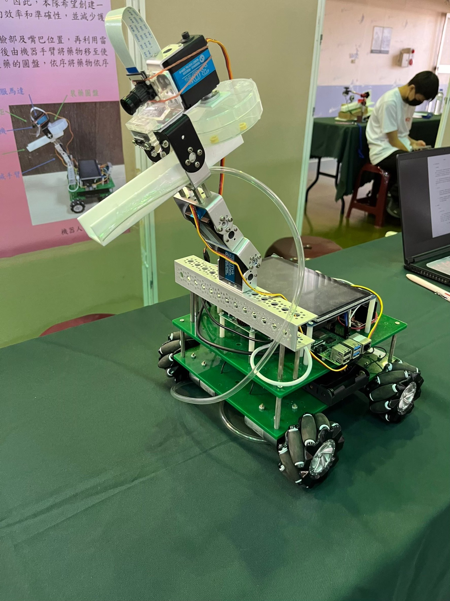
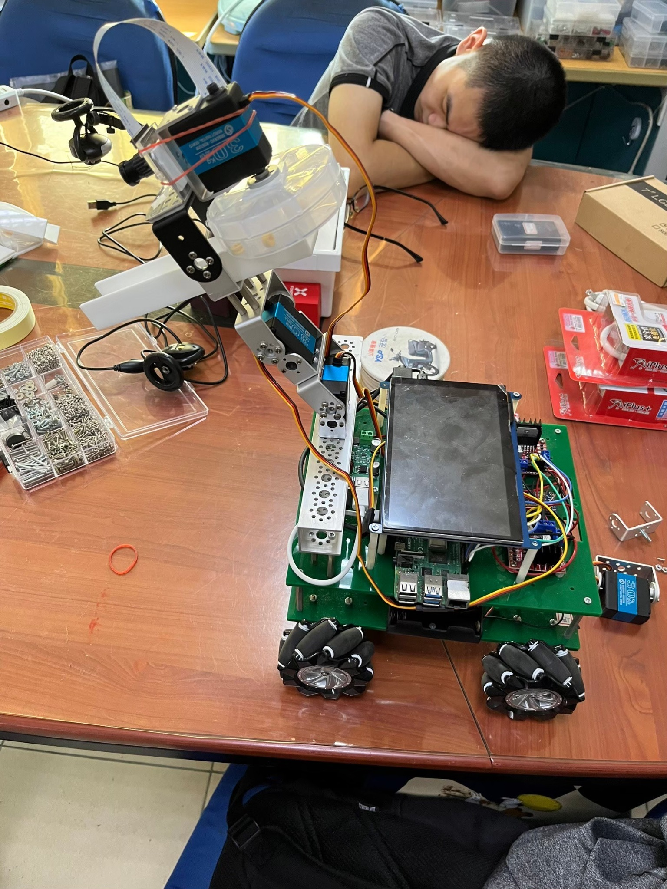
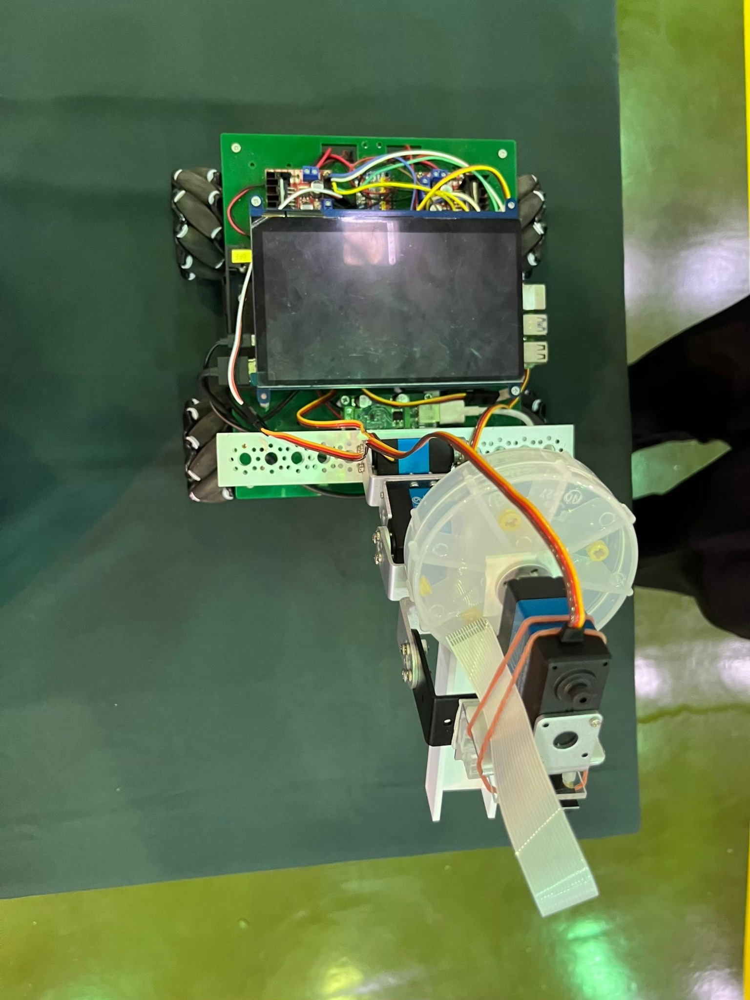

# Pill Dispenser Robot  

This project presents an **automatic medication dispensing robot** designed to assist bedridden patients or people with memory challenges.  
The robot automatically identifies the user, aligns a mechanical arm with the patient’s mouth and releases a single pill at the scheduled time.  
It addresses common problems in traditional medication routines—such as forgetting doses or struggling to reach pill containers—by combining vision‑based tracking with mechanical automation.  

## Awards and Recognition

The team participated in the **2024 TIRC Taiwan Intelligent Robot Contest** (高中職組 C2 機器人創意設計競賽) and won **second place**.  
The certificate from National Chin‑Yi University of Technology and photos of the working prototype are reproduced below:

.PNG)

## Design and Planning

The idea originated from real clinical needs: many patients have difficulty moving or remembering to take medication.  
To address this, the robot uses **two main modules**:

1. **Raspberry Pi (vision & processing)** – A Raspberry Pi equipped with a USB camera runs a Python script that uses OpenCV Haar Cascades for face and mouth detection. It calculates the mouth coordinates (\(x, y\)) and sends them over UART to the motion controller. The coordinates are displayed in real‑time to help adjust alignment【635291607221944†L595-L640】.  
2. **Arduino (motion & dispensing)** – An Arduino receives the coordinates, controls an MG995 servo motor that moves the mechanical arm towards the mouth and operates a second servo to rotate the pill disc. The disc is transparent and has precision holes sized to hold a single pill; interchangeable discs allow different pill sizes【635291607221944†L618-L624】. The robot uses mecanum wheels for mobility and may include additional sensors (ultrasonic hand detection, fingerprint, heart‑rate/SpO₂ and temperature sensors) to enhance safety and user verification【635291607221944†L595-L640】.  

### Hardware Components

| Component                        | Purpose                                              |
|----------------------------------|------------------------------------------------------|
| **Raspberry Pi**                 | Main controller for image processing & scheduling     |
| **USB camera**                   | Captures face and mouth images                       |
| **MG995 servo motor**           | Moves the mechanical arm                             |
| **Standard servo motor**        | Rotates the pill disc                                |
| **Transparent pill disc & tube** | Holds and guides pills; holes ensure single pill dispense【635291607221944†L618-L624】 |
| **Arduino**                      | Controls servos and locomotion (mecanum wheels)      |
| **Mecanum wheels**               | Provide omnidirectional mobility                     |
| **Fingerprint sensor**           | Biometric user verification                          |
| **MAX30102 sensor**              | Measures heart rate and oxygen saturation【635291607221944†L595-L640】 |
| **DS18B20 temperature sensor**   | Measures body temperature【635291607221944†L595-L640】 |
| **SIM800L GSM module**           | Sends SMS notifications                              |

### Software Development

Development is split into **software** and **hardware** phases:

- **Python & OpenCV** – The Raspberry Pi runs Python 3 with OpenCV. Face and mouth detection is implemented using Haar Cascade classifiers. The detection algorithm was refined by resolving module import errors (e.g. using `from PIL import Image`) and correctly specifying the Haar Cascade XML paths. Real‑time video is processed, the mouth centroid is calculated and transmitted to the Arduino via UART.  
- **Arduino C/C++** – On the Arduino side, code written in the Arduino IDE receives the (\(x, y\)) coordinates, computes the necessary servo angles and drives the MG995 and standard servos accordingly. The Arduino also manages mecanum wheel motors and monitors sensors.  
- **Scheduling & notifications** – Medication schedules are stored on the Raspberry Pi. The system verifies the user with a fingerprint sensor, reads vital signs and then activates the dispenser. It sends notifications through SMS or cloud messaging platforms (Blynk, ThingSpeak, MQTT)【266709376490988†L1198-L1251】.

## Features

- **Biometric & identity verification** – A fingerprint sensor confirms authorised users and prevents misuse.  
- **Face & mouth detection** – OpenCV accurately locates the user’s mouth; coordinates are sent to the dispenser over UART.  
- **Single‑pill dispensing** – A servo‑driven disc with precision holes releases exactly one pill per dose; discs can be swapped for different pill sizes【635291607221944†L618-L624】.  
- **Vital sign monitoring** – Heart rate, oxygen saturation and body temperature sensors collect real‑time data【635291607221944†L595-L640】.  
- **Reminders & alerts** – A GSM module or IoT platform sends text messages or push notifications when it’s time to take medication【266709376490988†L1198-L1251】.  
- **Modular architecture** – Separate modules for imaging & processing, motion & dispensing, sensing and communications make it easy to extend or upgrade components.

## Getting Started

1. **Assemble the hardware:** Set up the chassis, mount the Raspberry Pi and camera, install the MG995 and standard servos, connect the transparent pill disc and guiding tube, and wire the sensors, fingerprint module and GSM module according to the schematic in the project report.  
2. **Install software:** On the Raspberry Pi, install Python 3, OpenCV, NumPy, PIL, pyserial and other dependencies (`pip install opencv-python numpy pillow pyserial`). Upload the Arduino sketch to the microcontroller using the Arduino IDE.  
3. **Configure schedules:** Update the medication schedule and contact details in `main.py` or a configuration file. Set the appropriate serial port for UART communication.  
4. **Run the program:** Execute `python main.py` on the Raspberry Pi. The program will continuously monitor the camera, recognise the user, read vital signs, dispense a pill at each scheduled time and send a notification.  
5. **Review logs & data:** Logs and sensor readings can be stored locally or uploaded to a cloud platform for caregiver access.

## Future Improvements

- **Mobile/Web interface:** Build a cross‑platform app that allows caregivers to monitor dispensing history and vital signs remotely via IoT platforms like Blynk or ThingSpeak【266709376490988†L1198-L1251】.  
- **Enhanced actuation:** Experiment with stepper motors or servos with feedback for higher positional accuracy【266709376490988†L1154-L1169】.  
- **AI‑assisted interaction:** Incorporate machine‑learning models to detect user gestures or voice commands for a more intuitive interface.  
- **Cloud integration:** Add MQTT or HTTP APIs to connect the robot to smart‑home ecosystems and enable remote updates.  
- **Safety features:** Integrate obstacle avoidance sensors and limit switches to ensure safe operation around the patient.

## Additional Documentation

This repository includes a detailed report and research materials:

- **`pill_dispenser_robot_report.md`** – A comprehensive report covering system architecture, hardware selection, software design, testing and conclusions.  
- **`醫療科技化及臨床照護自動化 二版.docx`** / **`醫療科技化及臨床照護自動化-1.pdf`** – The original project document (in Chinese) detailing the problem statement, design process, hardware lists and troubleshooting notes.  

## References

- X. Zhang, *Design of a Smart Medical Box for Automatic Pill Dispensing and Health Monitoring*. The system described in this paper uses stepper motors, laser‑cut pill disks and various sensors for biometric verification【635291607221944†L595-L640】【635291607221944†L618-L624】.  
- A. Yousuf et al., *A Systematic Review on Pill Dispensing Technologies*. This review summarises the use of servo/stepper motors, mobile apps, cloud platforms and MQTT messaging in medication dispensers【266709376490988†L1154-L1251】.

